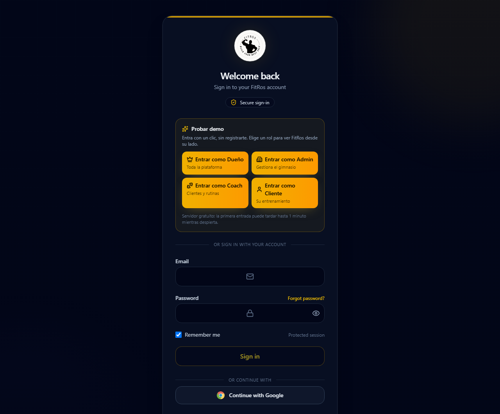

# FitRos Web

Frontend for **FitRos**, a gym / fitness-coaching management platform. Consumes the [fitros-api](https://github.com/LSvargas25/fitros-api) backend.

## Live demo

**https://fitros-web.onrender.com** — on the login page, pick a role under **"Probar demo"** and you're in with one click. No sign-up, no credentials to ask for.



> **Heads-up:** the app and its API ([fitros-api.onrender.com](https://fitros-api.onrender.com/health)) run on Render's free tier and sleep when idle. The first load or login can take **up to ~1 minute** while the server wakes up (a banner tells you when that's happening); after that it's fast.

| Button | Account | What to try |
|--------|---------|-------------|
| Entrar como **Dueño** | `owner@fitros.demo` | Platform-wide **Dashboard**; **Admin / Coach / Client Management** |
| Entrar como **Admin** | `admin@fitros.demo` | Gym **Dashboard**; **Clients** (view, add one); **Exercises** and **Foods** catalogs |
| Entrar como **Coach** | `coach@fitros.demo` | **Clients** roster; **Routines** (edit and publish the draft); **Weekly Plans**, **Meal Plans**; progress **Reports** and **Client Measures** |
| Entrar como **Cliente** | `client@fitros.demo` | **My Training** (start today's workout, log sets); **My Weekly Plan**; **My Nutrition**; **My Progress** / **My Measures** |

All four accounts use the password **`FitRos#2026`** if you'd rather type them in. They live in a fictional gym (*Iron Valley Fitness*) seeded by the API with coaches, clients, routines, plans, meal plans, measurements, workout history and notifications. The demo is shared, so you may see what earlier visitors changed.

### Resumen en español

Demo en vivo: **https://fitros-web.onrender.com**. En el login, la sección **"Probar demo"** tiene un botón por rol (Dueño, Admin, Coach, Cliente) que entra con un solo clic, sin registrarse. Contraseña de todas las cuentas: **`FitRos#2026`**. El servidor es gratuito y se duerme: **la primera carga puede tardar hasta 1 minuto**.

## Features

Interfaces matching the API's domain: gyms and staff (admins, coaches), client accounts and profiles, workout routines, weekly training plans, exercises, notifications and a dashboard — scoped by role (owner / admin / coach / client), plus nutrition (foods, meal plans) and client self-service (today's workout, progress, measures).

## Tech stack

- Angular (standalone components)
- TypeScript

## Project structure

```
src/app/
  core/     # singleton services, guards, interceptors, auth state
  features/ # feature pages (gyms, coaches, clients, routines, training plans, ...)
  layout/   # shell layout (nav, header)
  shared/   # reusable components, pipes, directives
```

## Configuration & running locally

API base URL is set in `src/environments/environment.ts`:

```ts
export const environment = {
  production: false,
  apiBaseUrl: 'https://localhost:7256'
};
```

Point `apiBaseUrl` at your running instance of fitros-api, then:

```bash
npm install
npm start
```

## Status

Active frontend project, paired with the fitros-api backend (the most architecturally complete backend in this portfolio).

## Tests

```bash
npm test
```

Karma + Jasmine unit tests run headless in CI on every push and PR (`.github/workflows/ci.yml`).

## Future improvements

- End-to-end tests (e.g. Playwright) for the main role flows
